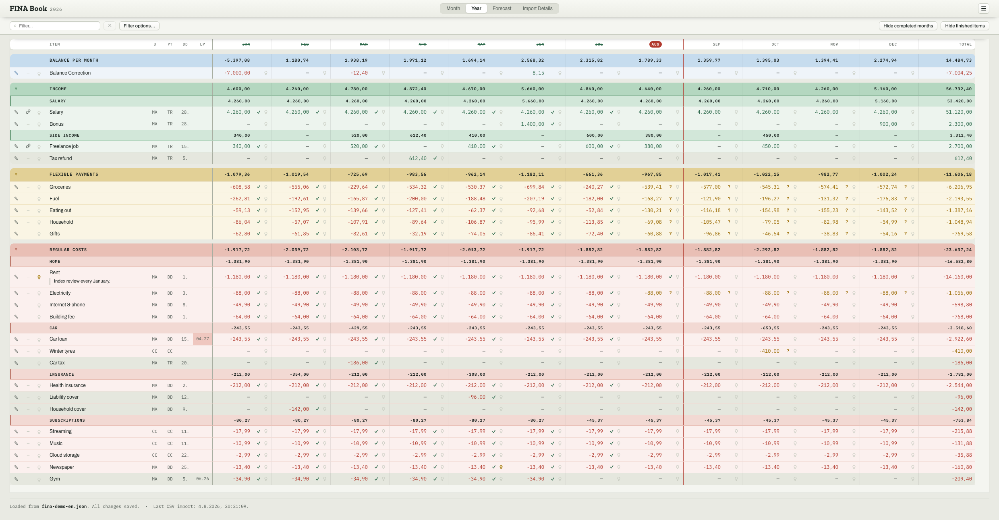
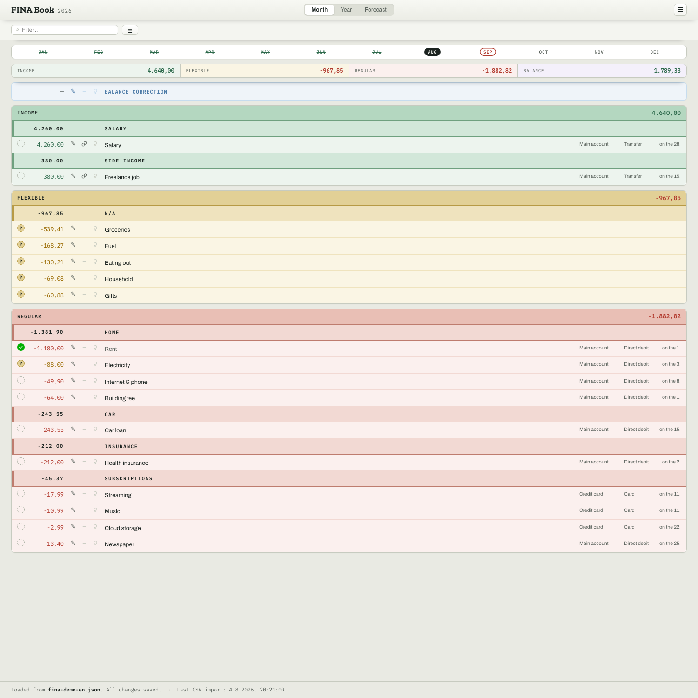
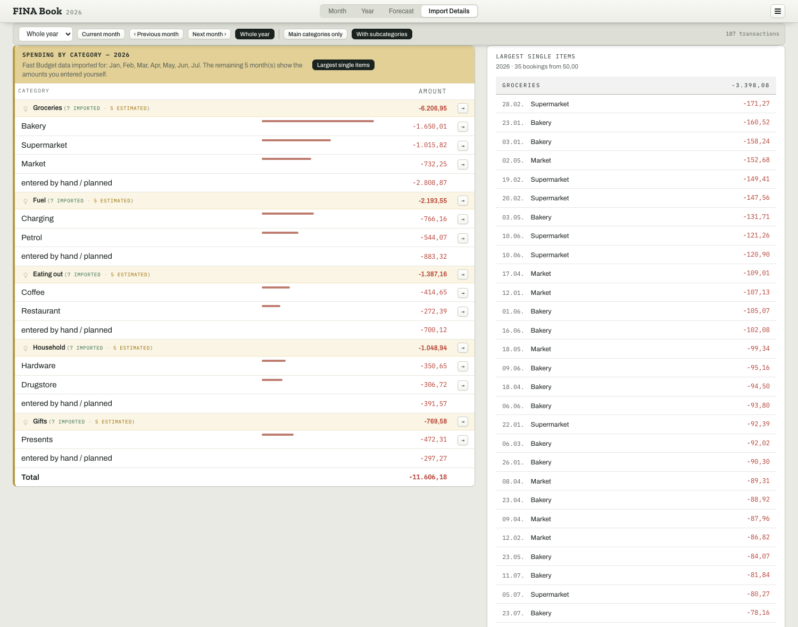
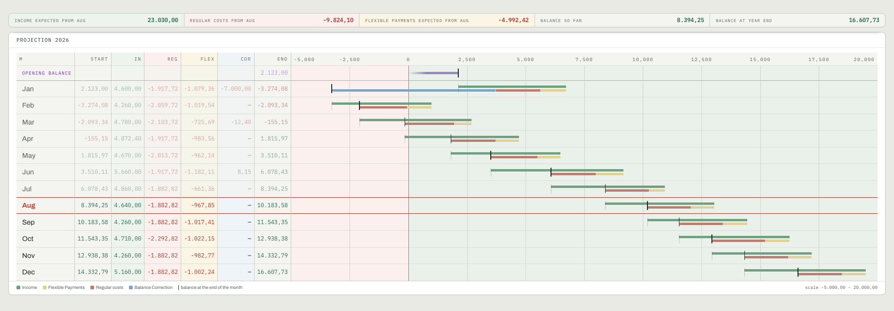
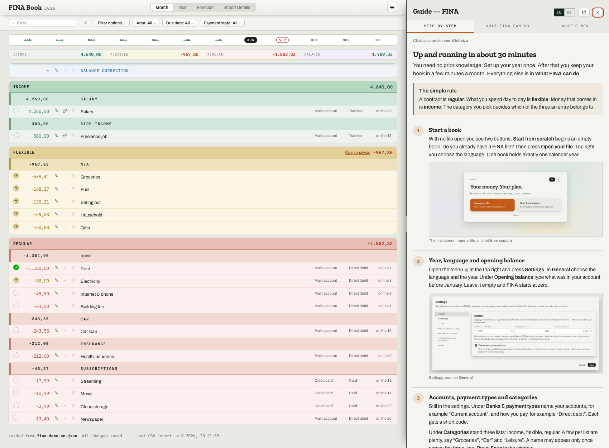

# FINA Book — your whole finance in one place

*Die Anwendung heißt nach außen **FINA Book** — im Fenstertitel, auf der Seite, in den
Paketen. Im Fließtext und in den Schlüsseln bleibt es beim kurzen **FINA**.*

Jahres- und Monatsabrechnung im Browser. Ersetzt eine handgepflegte
Google-Sheets-Tabelle und führt zwei Quellen zusammen: die regelmäßigen Kosten und
Einnahmen, die in FINA selbst gepflegt werden, und die flexiblen Alltagsausgaben
(**Flexible Payments**), die als CSV aus *Fast Budget* importiert werden. Darüber steht
eine einzelne Zeile **Balance Correction**, mit der sich der Saldo je Monat von Hand
ausgleichen lässt.

Kein Server, keine Datenbank, keine Frameworks. Die Anwendung enthält **keine Daten** —
sie startet leer und liest alles aus einer JSON-Datei, die auf dem eigenen Rechner liegt.

## Benutzen

Die Seite öffnen und auf **Load data** klicken. Bearbeiten, dann **Save data**.

- Mit geladener Datei beginnt FINA im **laufenden Monat** — dort wird gearbeitet. Ohne
  Datei steht die **Jahresansicht** vorn, denn dort legt man an. (Gehört die Datei zu einem
  anderen Jahr, ist der „laufende" Monat der Januar.)

- Chrome und Edge schreiben direkt in dieselbe Datei zurück.
- Firefox und Safari können das nicht; dort wird die Datei heruntergeladen.
- Gespeichert wird nur auf Klick. Ungespeichertes steht **fett und rot** am Dateinamen in der
  Kopfzeile; die Knöpfe daneben bleiben schlicht.
- Die Oberfläche startet auf **Englisch**. Unter **Settings** lässt sich auf Deutsch
  umstellen — zusammen mit Abrechnungsjahr, Spaltenbreiten, der Grenze für die größten
  Einzelposten und den vier Listen. Alle diese Einstellungen stehen in der JSON-Datei und
  kommen beim Laden mit ihr zurück.
- **Guide** — der orange Knopf — klappt die Anleitung in der gewählten Sprache rechts neben
  der Tabelle auf. Sie bleibt beim Weiterarbeiten offen; ihre Breite lässt sich an der
  linken Kante ziehen.

Lokal genügt ein Doppelklick auf `index.html` — es wird nichts nachgeladen, was
ein Browser bei `file://` blockieren würde. Auch die drei Schriften liegen bei
(`css/fonts/`); FINA ruft keinen fremden Server auf.

### Ohne Browser: die Apps für Mac und Windows

Dieselben Dateien laufen auch in einem eigenen Fenster — Electron, also dieselbe
Chromium-Maschine, an der FINA ohnehin gemessen ist. Die Pakete stehen auf der
[Downloadseite](https://linked2ag.github.io/FINA/download/); gebaut werden sie aus
`desktop/`, beschrieben in [`desktop/README.md`](desktop/README.md).

Zu wissen ist dreierlei:

- **Sie sind noch nicht signiert.** Beim ersten Start warnt das System; die Downloadseite
  führt Schritt für Schritt daran vorbei.
- **Die Datendatei liegt außerhalb.** Die App auszutauschen rührt sie nicht an.
- **Web und Apps laufen auseinander.** Die Webseite bekommt jeden Push, die Apps nur eine
  gesetzte Marke — das ist ein Kanal und kein Rückstand. Die App fragt beim Start einmal
  `version.json` ab und meldet, wenn es etwas Neueres gibt; abschaltbar unter
  **Settings → General**. Es ist die einzige Netzverbindung, die FINA aufbaut.

## Die vier Ansichten

Alle Bilder zeigen dieselbe Beispieldatei (`fina-demo-belka.json`) — erfundene Zahlen,
keine echten Daten.

**Jahr** — die Startansicht: je Position eine Zeile, je Monat eine Spalte. Links kleben
Position und die vier schmalen Kürzelspalten **B** (bank), **PT** (payment type),
**DD** (due date) und **LP** (last payment), rechts steht die Jahressumme. Abgeschlossene
Monate klappen zu, der laufende Monat ist rot eingerahmt.



**Monat** — die Arbeitsansicht: Kennzahlen oben, darunter Balance Correction, Einnahmen,
Flexible Payments und die regelmäßigen Kosten. Abgehakt wird über die Siegel links; was
die drei Zeichen bedeuten, steht im grauen Kasten ganz unten — sie gelten in jedem Block.
Über den regelmäßigen Kosten steht eine Filterzeile: links Fälligkeit und ein Suchfeld, das
beim Tippen in Name, Betrag, Bank, Zahlungsart, Kategorie und Notiz sucht, rechts der
Zahlungsstand. Nach jedem Haken springt die Schreibmarke dorthin zurück.



**Flexible Payments** — was die alltäglichen Kategorien im gewählten Zeitraum kosten,
rechts die größten Einzelposten aus dem CSV-Import.



**Forecast** — wie das Jahr ausgeht: die Hochrechnung Monat für Monat und rechts die
Annahme je Flexible-Payments-Kategorie.



**Guide** — der orange Knopf klappt die Anleitung rechts auf. Sie bleibt offen, während
man weiterarbeitet, und lässt sich an ihrer linken Kante breiter oder schmaler ziehen. Sie
hat zwei Reiter: **Schritt für Schritt** führt einen Anfänger einmal durch das Anlegen des
Buches, **Was FINA kann** beschreibt die Anwendung für den, der so etwas schon kennt. Beide
zeigen dieselben Bildschirmfotos wie diese README; ein Klick öffnet eines groß.



## Aufbau

Struktur, Gestaltung und Logik liegen getrennt. Wer etwas ändern will, findet die Stelle
über den Dateinamen.

```
index.html              Gerüst der Seite und die Ladereihenfolge
version.json            welche Fassung die Apps als aktuell melden

css/
  tokens.css            Farben, Schriften, Reset — hier wirkt jede Änderung global
  layout.css            Kopfzeile, Reiter, Karten, Kennzahlen
  components.css        Schaltflächen, Siegel, Lampen, Formulare, Fenster, Listen
  ledger.css            die einspaltigen Tabellen (Monat, Prognose, Flexible Payments)
  matrix.css            die Jahresmatrix
  download.css          nur für die Downloadseite
  fonts/                die drei Schriften als .woff2, dazu ihre Lizenz

download/
  index.html            die Seite, von der die Apps geladen werden

desktop/                der Electron-Rahmen für Mac und Windows (siehe dortige README)

js/
  i18n.js               alle Texte auf Englisch und Deutsch, Monatsnamen, YEAR, CUR
  config.js             Ansichtsliste, Auswahllisten, Symbole, VERSION
  format.js             Zahlen, Text, Fälligkeitsbeschriftungen — reine Funktionen
  state.js              Datenmodell, leerer Zustand, migrate() für ältere Dateien
  categories.js         Kategorien umbenennen/anlegen/löschen samt Referenzen
  calc.js               alle abgeleiteten Zahlen; liest den Zustand, ändert ihn nie
  storage.js            Laden und Speichern der JSON-Datei
  csv.js                CSV-Import aus Fast Budget
  sheet.js              CSV-Import einer FINA-Tabelle (ein ganzes Jahr)
  ui.js                 Kurzmeldung, Fensterschließen, Notizlampe
  views/                je Ansicht eine Datei: jahr · monat · prognose · kakeibo
  dialogs/              item · kakeibo-betraege · settings · csv-import · sheet-import · guide
  app.js                zeichnet, verdrahtet die Klicks, startet — wird zuletzt geladen

doc/
  make-shots.py         erzeugt die Bildschirmfotos neu (siehe unten)
  img/                  die Bilder für README und Anleitung
```

Die `<script>`-Dateien sind klassische Skripte in fester Reihenfolge, keine ES-Module.
Das ist Absicht: Module würden über `file://` an der CORS-Regel scheitern und die Datei
ließe sich nicht mehr per Doppelklick öffnen. Neue Dateien deshalb in
`index.html` an der passenden Stelle eintragen — Werkzeuge vor Ansichten,
`app.js` bleibt die letzte.

## Einstellungen und Listen

Sprache, Abrechnungsjahr, Spaltenbreiten der Jahresmatrix, die Grenze für die größten
Einzelposten und alle vier Listen — Banken,
Zahlungsarten, regelmäßige Kategorien und Flexible-Payments-Kategorien — liegen im Fenster
**Settings**. Es ist in fünf Bereiche geteilt: links das Menü, rechts der gewählte Bereich;
das Pluszeichen zum Anlegen steht direkt hinter der jeweiligen Überschrift.
Alle vier lassen sich anlegen,
umbenennen, per Ziehen sortieren und entfernen. Benennt man eine Flexible-Payments-Kategorie
um, wandern Planwerte, Ist-Werte, Korrekturen und die importierten Buchungen mit. Entfernt
man sie, werden genau diese Daten gelöscht — die Auswertung zeigt nur Kategorien, die in
dieser Liste stehen.

Die Beträge einer solchen Kategorie werden nicht dort, sondern über den Stift in der
Jahres- oder Monatsansicht eingetragen.

Eigene Kategorienamen sind Daten und stehen in der JSON-Datei; wer sie auf Englisch haben
möchte, benennt sie hier um. Die fest eingebauten Namen — `EINNAHMEN`,
`(ohne Hauptkategorie)`, `(ohne Kategorie)` — erscheinen dagegen in jeder Sprache
englisch (`INCOME`, `(no main category)`, `(no category)`), während der Schlüssel in der
Datei unverändert bleibt.

## Balance Correction

Eine feste Zeile über dem Einnahmenblock, hellblau, in der Monats- wie in der
Jahresansicht. Sie nimmt je Monat einen Betrag auf — plus oder minus — für alles, was über
die Monate nicht aufgeht. Der Wert geht in den Saldo ein und steht in der Prognose als
eigene Spalte. Gepflegt wird sie über denselben Stift wie jeder andere Posten; löschen
lässt sie sich nicht.

## Bildschirmfotos erneuern

Die Bilder in `doc/img/` zeigen die laufende Anwendung und veralten deshalb mit jeder
Änderung an der Oberfläche. Sie entstehen nicht von Hand:

```sh
python3 doc/make-shots.py            # alle Bilder
python3 doc/make-shots.py set-lists  # nur eines
```

Das Skript baut aus `index.html` eine Wegwerfseite, lädt eine Beispieldatei hinein,
fotografiert die gewünschten Ausschnitte mit Chrome ohne Fenster und räumt danach auf.
Welche Bilder es gibt, steht in der Liste `SHOTS` am Anfang des Skripts; der Pfad zur
Beispieldatei ebenfalls.

## Weiterlesen

- [CLAUDE.md](CLAUDE.md) — Landkarte für Änderungen: welche Datei wofür, und die drei Regeln
- [SPEC.md](SPEC.md) — Datenmodell, Rechenregeln, CSV-Format, bekannte Grenzen
- [PR.md](PR.md) — warum es FINA gibt und was es gegenüber der Tabelle besser macht

Diese drei Dateien gehören zur Arbeit am Projekt, nicht zur Anwendung — der
Veröffentlichungs-Workflow lässt sie deshalb aus (`.github/workflows/pages.yml`).

## Lizenz

Copyright © 2026 Alex ([github.com/linked2ag](https://github.com/linked2ag)).
**Alle Rechte vorbehalten** — siehe [LICENSE](LICENSE).

Benutzen ist erlaubt und erwünscht. Vervielfältigen, Weitergeben und der Betrieb einer
eigenen Kopie sind es nicht. Dass der Quelltext im Browser lesbar ist, liegt daran, dass
ein Browser ihn zum Ausführen braucht; ein Verzicht auf Rechte ist es nicht.
